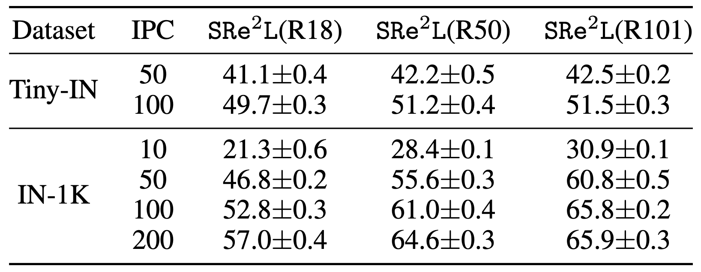

# SRe2L

Official PyTorch implementation of paper:
>[__"*Squeeze*, *Recover* and *Relabel*: Dataset Condensation at ImageNet Scale From A New Perspective"__](https://arxiv.org/abs/2306.13092)<br>
>[Zeyuan Yin](https://zeyuanyin.github.io), [Eric Xing](http://www.cs.cmu.edu/~epxing/), [Zhiqiang Shen](http://zhiqiangshen.com/)<br>
>MBZUAI, CMU

[`[Project Page]`](https://zeyuanyin.github.io/projects/SRe2L/)  [`[Paper]`](https://arxiv.org/abs/2306.13092)

<div align=center>

</div>

## Abstract

We present a new dataset condensation framework termed *<b>S</b>queeze* (), *<b>Re</b>cover* () and *<b>Re</b>labe<b>l</b>* () (SRe<sup>2</sup>L) that decouples the bilevel optimization of model and synthetic data during training, to handle varying scales of datasets, model architectures and image resolutions for effective dataset condensation. The proposed method demonstrates flexibility across diverse dataset scales and exhibits multiple advantages in terms of arbitrary resolutions of synthesized images, low training cost and memory consumption with high-resolution training, and the ability to scale up to arbitrary evaluation network architectures. Extensive experiments are conducted on Tiny-ImageNet and full ImageNet-1K datasets. Under 50 IPC, our approach achieves the highest 42.5% and 60.8% validation accuracy on Tiny-ImageNet and ImageNet-1K, outperforming all previous state-of-the-art methods by margins of 14.5% and 32.9%, respectively. Our approach also outperforms MTT by approximately 52&times; (ConvNet-4) and 16&times; (ResNet-18) faster in speed with less memory consumption of 11.6&times; and 6.4&times; during data synthesis.


## Distillation Animation

<div align=left>

</div>

******************************
Kindly wait a few seconds for the animation visualizations to load.
******************************

## Distilled ImageNet

<div align=left>

</div>

## Squeeze 

- For ImageNet-1K, we use the official PyTorch pre-trained models from [Torchvision Model Zoo](https://pytorch.org/vision/stable/models.html).

- For Tiny-ImageNet-200, we use official [Torchvision code](https://github.com/pytorch/vision/tree/main/references/classification) to train the model from scratch.

## Data download
ImageNette (choose the full size version): https://github.com/fastai/imagenette \
Tiny-ImageNet: https://gist.github.com/moskomule/2e6a9a463f50447beca4e64ab4699ac4 \
ImageNet: https://gist.github.com/bonlime/4e0d236cf98cd5b15d977dfa03a63643 \
Others: to be updated

Put all data in a directory specified with -r. The directory should end with a '/' like '/home/data/', otherwise it will report errors.
```plaintext
data-root/
├── imagenette/
│   ├── train/
│   ├── val/
│   └── ...
├── tiny-imagenet/
│   ├── train/
│   ├── val/
│   └── ...
└── ...
```


## Run all

Before running the code, modify the Pytorch source code according to this [train/README.md](train/README.md) \
  - 我们的方法是在squeeze这步加CURE。训练一个新的teacher model要加-p，用已有的就不加。
  - -C 表示是否用CURE，大小写敏感。h 比较固定，lamda 可以试一些值
  - -b 是synthetic images的正则化系数。用batchnorm statistics正则化，有点类似generative prior，可能会影响robustness。

```bash
nohup bash run.sh -x 1 -y 1 -d imagenette -r /home/user/data/ -u 0 -b 10.0 -p -C -h 3.0 -l 100 >> output1.log 2>&1 &
````

## Recover 

More details in [recover/README.md](recover/README.md).
```bash
cd recover
sh recover.sh
```

## Relabel 

More details in [relabel/README.md](relabel/README.md).
```bash
cd relabel
sh relabel.sh
```

## Train on Distilled Data

More details in [train/README.md](train/README.md).
```bash
cd train
sh train.sh
```

## Download

You can download distilled data and soft labels from https://zeyuanyin.github.io/projects/SRe2L/#Download.

## Results

Our Top-1 accuracy (%) under different IPC settings on Tiny-ImageNet and ImageNet-1K datasets:

<div align=center>

</div>


## Citation

If you find our code useful for your research, please cite our paper.

```
@article{yin2023squeeze,
	title = {Squeeze, Recover and Relabel: Dataset Condensation at ImageNet Scale From A New Perspective},
	author = {Yin, Zeyuan and Xing, Eric and Shen, Zhiqiang},
	journal = {arXiv preprint arXiv:2306.13092},
	year = {2023}
}
```

